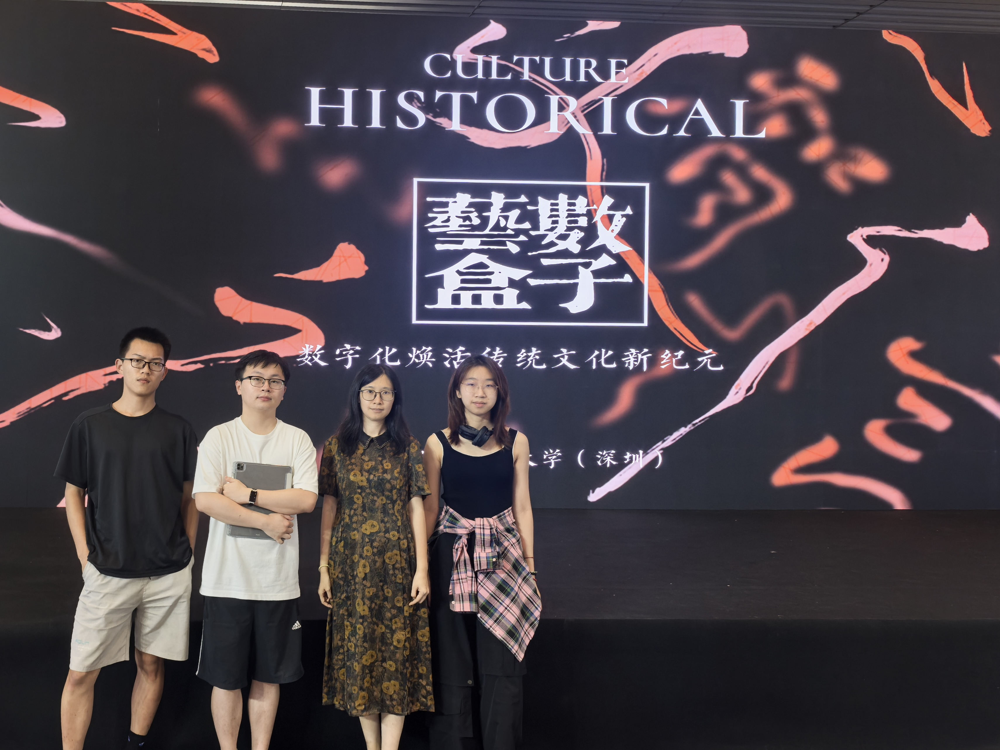
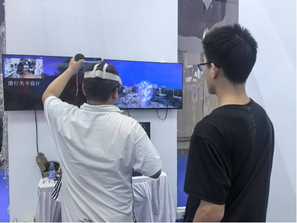
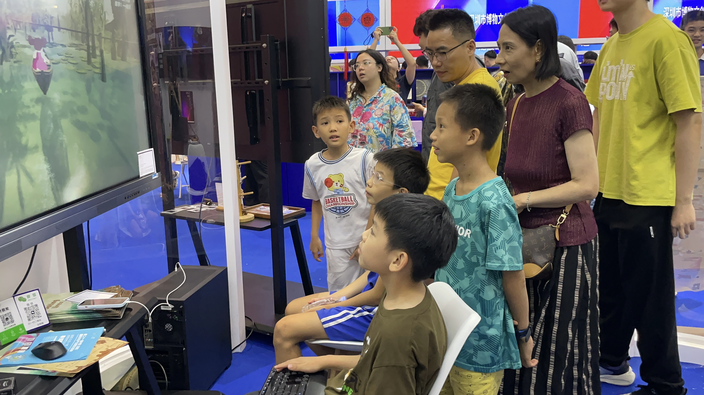
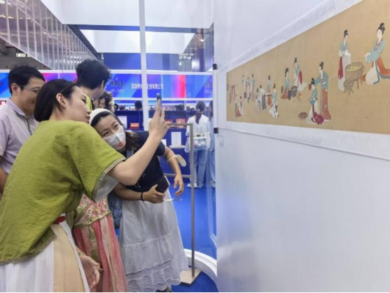
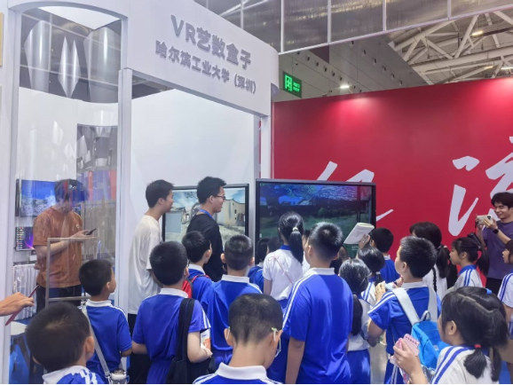
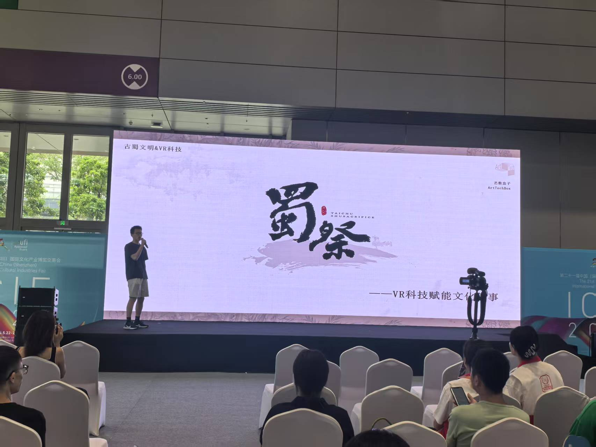

# 25年深圳文博会参展
&emsp;&emsp; 2025年5月22日至26日，第二十一届中国（深圳）国际文化产业博览交易会在深圳国际会展中心盛大举行。艺数盒子社团受邀参加“世界与中国青年文创项目孵化”展台。展台位于10号馆文博会的“展眼”——文创中国展区。

>
文博会社团部分师生在发布会现场

&emsp;&emsp; 在指导老师徐津津和钟梦蕾的悉心指导下，我们精心准备了一系列独具创意与文化内涵的作品：

* 《蜀祭：太初》是基于古蜀国文明的沉浸式VR体验，通过互动与探索引发观众对文化遗产的思考与共鸣；

>
VR古蜀文明沉浸式体验

* 《星图长歌》项目立足于敦煌莫高窟的“敦煌星图”文化遗产，借助生成式AI技术进行多方位的创新性交互设计；

>
参观群众

* 《草木染——AR长卷》以中国传统植物染色技艺为主题，结合现代AR技术，打造一个沉浸式的传统文化体验项目；

>
AR草木染长卷体验

* 《浮生之路》以疍民从水上漂泊到岸上定居的“上岸之路”为核心叙事，通过沉浸式交互体验，探索非遗数字化保护与生态教育的创新结合。

>
社团成员为深圳中小学生讲解文化与科技

&emsp;&emsp; 在“文创中国”展区，艺数盒子的展位吸引了众多观众的目光。社团成员将传统文化与现代科技相结合，通过AR、VR以及AI技术的呈现，让观者感受到了科技与传统文化的深度融合。参展作品受到了来自博物馆、文旅集团等诸多行业内专家的鼓励与肯定。  

>
文博会社团项目发布会现场
