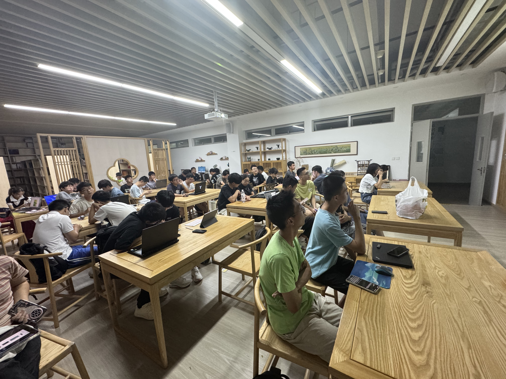
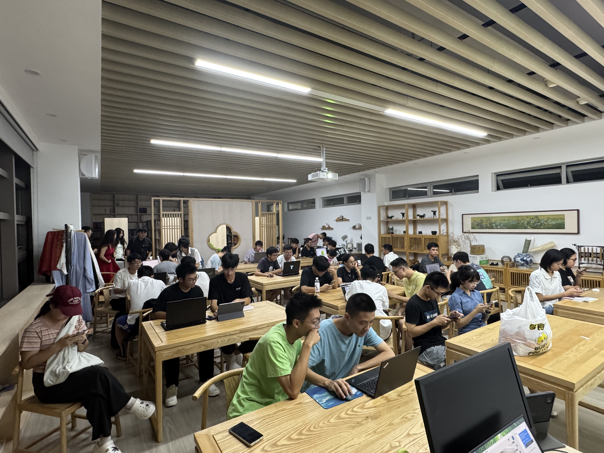

# DemoDay：在展示与交流中推动项目成长

在游戏开发的道路上，及时的反馈和清晰的规划同样重要。社团常驻活动 **DemoDay** 正是为此而生：一个专为开发者打造的**阶段性项目展示与评审会**。在这里，你将定期展示项目进展，收获真实反馈，并与志同道合的伙伴共同确定下一阶段的目标，确保你的创意始终朝着正确的方向高速迭代。

>
DemoDay 现场，专注聆听与交流

## 活动流程：一次高效的成长循环
DemoDay 拥有一个结构清晰、目标明确的流程，旨在最大化每次展示的价值：
1.  **项目提报**：参与者提前提交项目信息与展示申请，让组织者和听众都能提前了解背景。
2.  **进展展示**：在DemoDay现场，你有机会**完整演示当前阶段已实现的功能**，分享开发中的心得与挑战。
3.  **计划阐述**：展示过后，你需要提出具体的**下一阶段开发计划**，明确未来短周期内的目标和要解决的核心问题。
4.  **集中研讨**：这是活动的核心环节。现场的其他项目组成员、社团核心成员将基于你的演示和计划，从技术实现、玩法设计、用户体验等多角度**提出中肯的建议和可行的解决方案**。大家会共同商讨，帮助你优化和确定下一个最应优先完成的“开发里程碑”。

## 不止是展示，更是项目推进器
DemoDay 的核心价值在于它创造了一个**开放、互助的交流场**。对于展示者，这是获得宝贵外部视角、避免闭门造车的机会；对于参与者，在聆听和提问中也能激发自身项目的灵感。通过这种定期的“复盘-规划-校准”，项目得以**快速迭代，并始终保持较高的开发质量**。

>
热烈讨论中的DemoDay现场

目前，DemoDay 主要作为 **30天游戏开发活动** 的配套环节，为参与团队提供关键的阶段性指导。在该活动结束后，它将转型为服务于**社团主推的长期项目**和**所有对项目开发有热情的成员**的常设平台。

如果你正带领一个项目前行，或渴望在交流中汲取经验，DemoDay 都将是你的最佳加油站。欢迎关注活动通知，带着你的作品来mkdo此展示、交流，共同推动创意的成熟与落地。