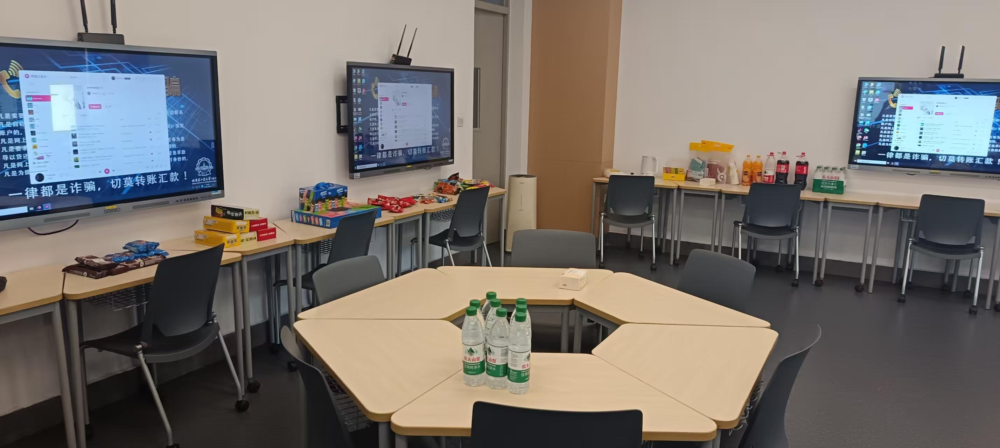
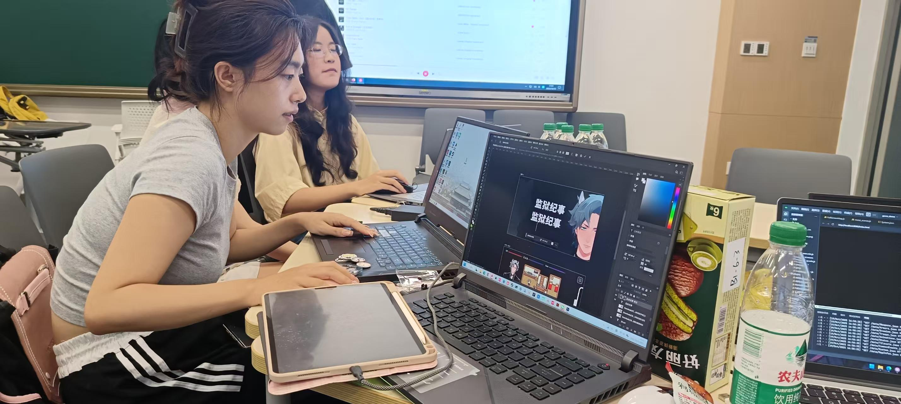

# 社团茶话会：在轻松交流中激发创意火花

为了更好地促进社团成员间的联系并为DemoDay营造活跃氛围，我们特别在每次项目汇报前举办了**社团茶话会**。这是一个充满零食、游戏和自由交流的轻松工作坊，旨在让成员们在享用茶点饮料、体验VR/PS5游戏的过程中，自然交流开发经验，激发创作灵感。

>
茶话会现场布置，零食与游戏设备已就绪

## 活动亮点：交流与体验并重
茶话会不仅提供了丰富的茶水、饮料和各种零食，还设置了**VR游戏和PS5游戏试玩区**。大家可以在试玩后，随时就游戏的设计、技术实现或体验感受进行即兴讨论。这种围绕具体游戏体验的交流，常常能碰撞出新的想法，为各自的DemoDay项目带来直接的启发。

>
在茶话会上体验游戏

## 自由探讨，互助成长
活动的核心环节是**自由交流**。没有固定的议程，成员们可以就当前开发中遇到的难题、感兴趣的新技术，或是游玩某款游戏后的感悟，与身边任何一位伙伴展开讨论。这种非正式的交流环境极大地促进了不同项目组之间的经验分享和技术互助，为接下来DemoDay上更具深度的项目展示做了良好的预热。

>
热烈讨论中的茶话会现场

这场茶话会成功地在紧张的开发周期中创造了一个宝贵的“充电站”和“灵感池”。我们相信，在零食与游戏的陪伴下，思想的自由碰撞能催生最出色的创意。期待在下一次茶话会上，与你继续畅谈游戏与开发的一切！