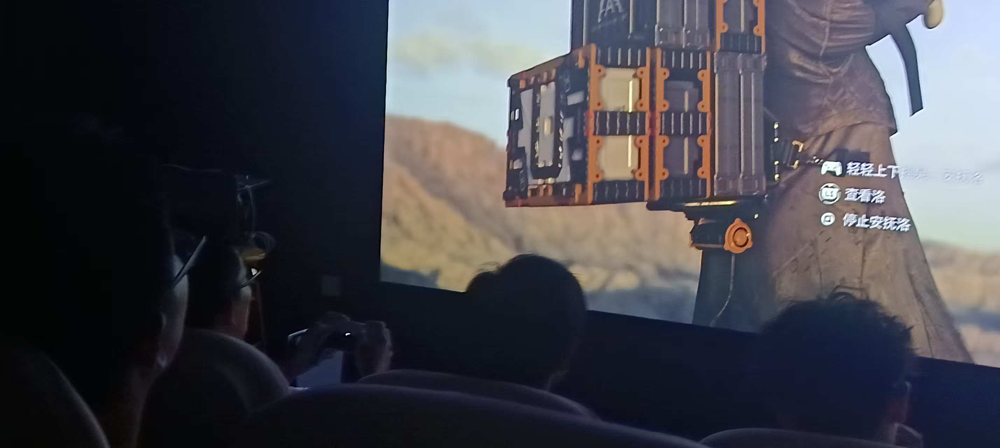
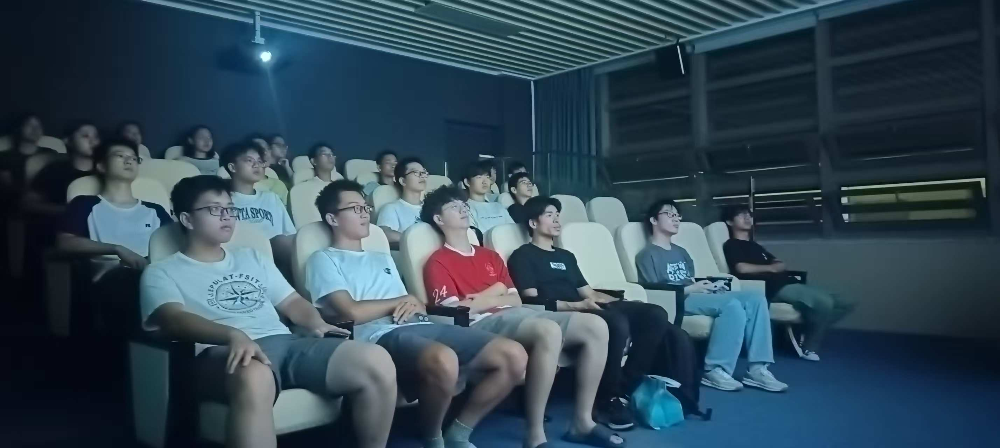
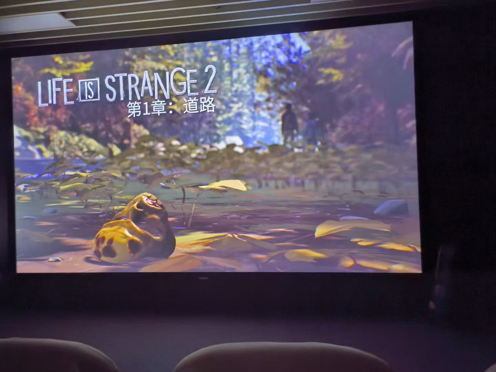

# 游戏沙龙：在剧情世界中思考与共鸣

每周日晚7点，社团的**游戏沙龙活动**准时在T4609放映室与你相约。这并非一场速通竞速，而是一次次关于叙事、选择与情感的沉浸式体验。我们聚焦于《奇异人生》、《暴雨》等**电影式剧情游戏**，如同共同参与和解读一部部可以“互动”的影视佳作。

>
死亡搁浅2

为保证每位参与者的体验，我们采用灵活的参与形式：人数较少时，大家**轮流传接手柄**，亲身做出影响故事走向的关键抉择；人数较多时，则**提前确定主要操作员**，其他人则成为故事的“共同决策者”，在关键分支进行讨论与投票。这种模式不仅降低了参与门槛，更在交流中碰撞出无数思想的火花。

>
活动现场

截至目前，我们的游戏沙龙已共同体验了多部引人入胜的作品。每一款游戏都为我们打开了一个新的世界，带来不同的思考与感动：

*   **《奇异人生》** 与 **《奇异人生2》**：在时间回溯与兄弟羁绊中，探讨责任、成长与人性的复杂。
*   **《暴雨》**：一场追凶之旅，在压抑的氛围中拷问每一位父亲的选择。
*   **《Immortality》** 与 **《Her Story》**：打破常规叙事，像侦探一样通过影像碎片拼凑隐藏的真相。
*   **《死亡搁浅2》**：在广阔的废土世界上，体验连接与送达的独特哲学。
*   **《艾迪芬奇的记忆》**：漫步于神奇的芬奇老宅，在光怪陆离中感受一个家族忧伤而温暖的传奇。

>
奇异人生2

如果你也喜欢在精彩的故事中寻找共鸣，享受思考与分享的乐趣，欢迎通过社团QQ群内的报名链接加入我们。每周日晚，一起逃离现实片刻，潜入另一个世界的悲欢离合。