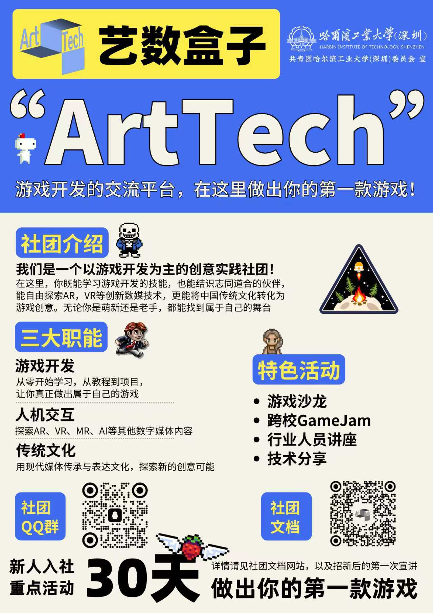
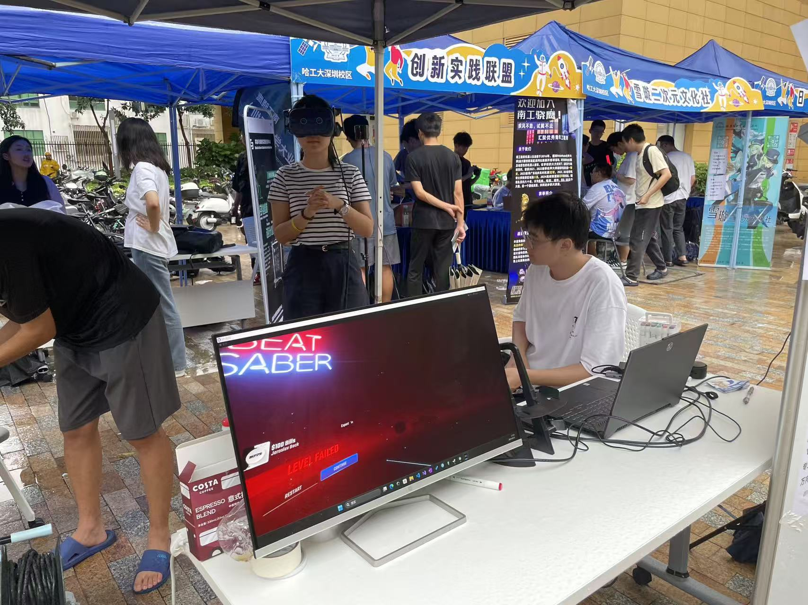
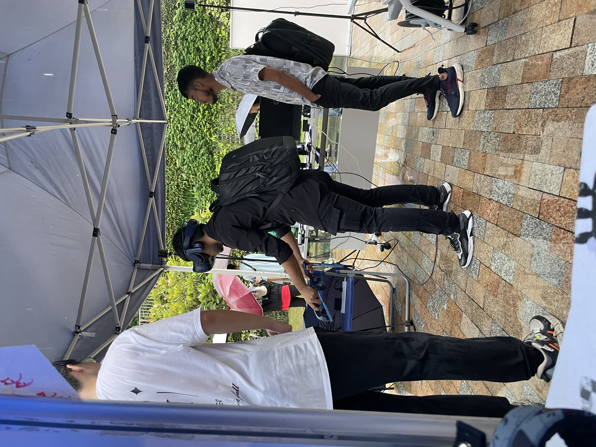

# 社团招新：欢迎加入我们的创意之旅

每年九月中旬，随着新学期的开始，学校迎来了一场热闹非凡的“百团大战”社团招新活动。作为学校团委统一组织的年度盛事，我们社团也会精心布置自己的展示摊位，通过游戏试玩、技术展示和互动交流，向新生们传递社团的创新精神与技术热情。招新不仅是吸纳新成员的重要窗口，更是为后续的新人立项和项目开发奠定基础，让每一位感兴趣的同学都能找到属于自己的创作舞台。

>
25年宣传海报

回顾过往，我们的招新活动始终围绕“从体验走向创造”的理念。前年的展位上，我们提供了**VR游戏试玩**，让同学们沉浸式地感受前沿技术的魅力；而去年，社团进一步升级，带来了**由成员自制的游戏试玩**，并设计了独具特色的周边礼品作为互动奖励。这一变化不仅展现了社团项目开发能力的提升，也体现了我们从技术体验者向内容创造者的成长。

>
24年招新现场
 

每年的招新都是社团发展的缩影：我们不仅注重吸引新人，更致力于为他们提供持续的学习环境和项目支持。例如，新成员在加入后可直接参与30天游戏开发等活动，将招新中的兴趣转化为实际成果。未来，我们期待更多热爱游戏开发、富有想象力的同学加入，一起创造更多属于你自己的作品。

>
试玩游戏

通过不断的创新与实践，我们希望在每年的“百团大战”中，让更多同学感受到技术的温度与创作的快乐。如果你也渴望动手实现自己的创意，欢迎加入我们，开启你的游戏开发之旅！