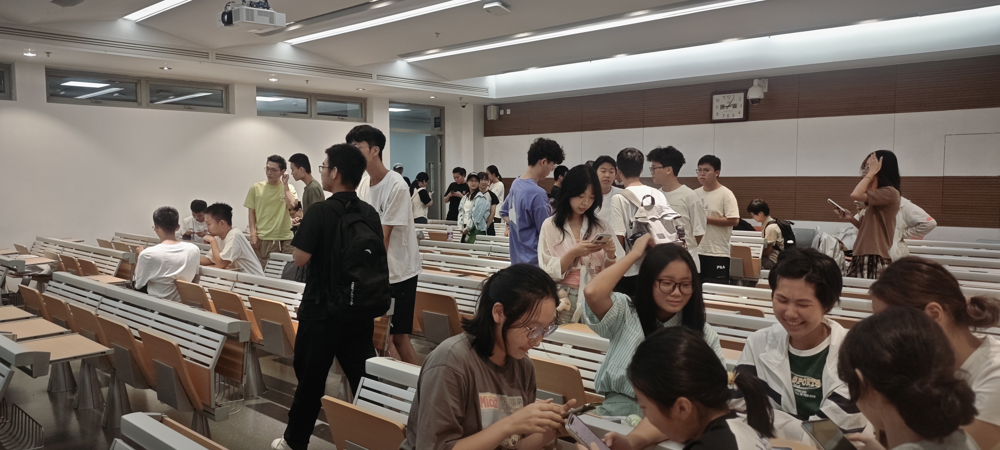

# 创意实现，从零到一：ArtTech 30天游戏开发挑战​​

>
组队讨论

&emsp;&emsp;你是否有一个绝妙的游戏创意，却苦于不知如何开始？你是否想体验从零到一创造世界的成就感？ArtTech 社团的 ​​30天游戏开发活动​​ 正是为你准备的绝佳舞台！

&emsp;&emsp;本次活动旨在为所有对游戏开发充满热情的同学，尤其是新手和入门者，提供一次完整、深入的开发体验。从​​9月30日到10月30日​​，你将和队友们一起，选择心仪的游戏引擎，在社团的全力支持下，将脑海中的想法变为一款可实际运行的游戏。

**​​在这里，你不仅能实现创意，更能获得全方位的支持：​​**

* **实践指导**​​：社团核心成员与经验丰富的开发者将提供从技术到策划的全程帮助。
* **资源支持**​​：社团专属工位（T4607, T4807, T4709）全天候开放，提供设备与场地。
* **周期复盘​**​：定期举办的 ​​Demo Day​​ 是你展示进度、交流问题、获取灵感的“头脑风暴”会。
* **友好氛围**​​：我们鼓励大家聚焦核心玩法，勇于试错。正如《游戏设计艺术》所言：“你做的前十个游戏都是垃圾，所以赶紧做掉吧！” 本次活动重在享受过程、积累经验、与志同道合的伙伴共同成长。

&emsp;&emsp;这不仅是一次开发挑战，更可能是你游戏开发生涯的起点。活动结束后，优秀项目还将有机会以​​大一立项​​或​​大创项目​​的形式延续，获得社团的长期支持。
创意之火，需要实践来点燃。

&emsp;&emsp;立即关注我们的社团文档站与群内通知，期待在接下来的Demo Day上看到你的精彩作品！