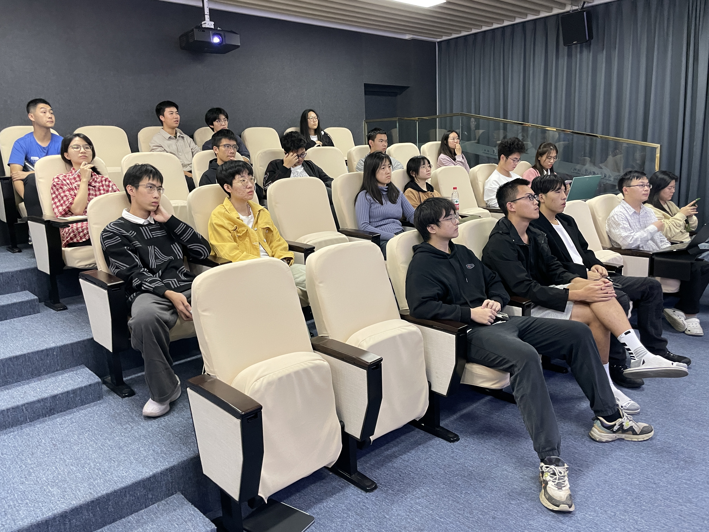
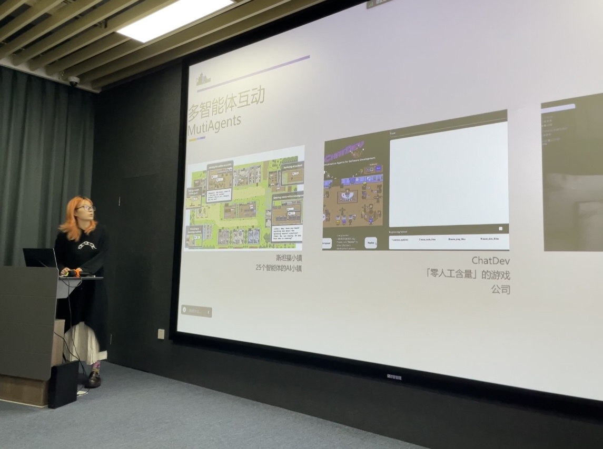
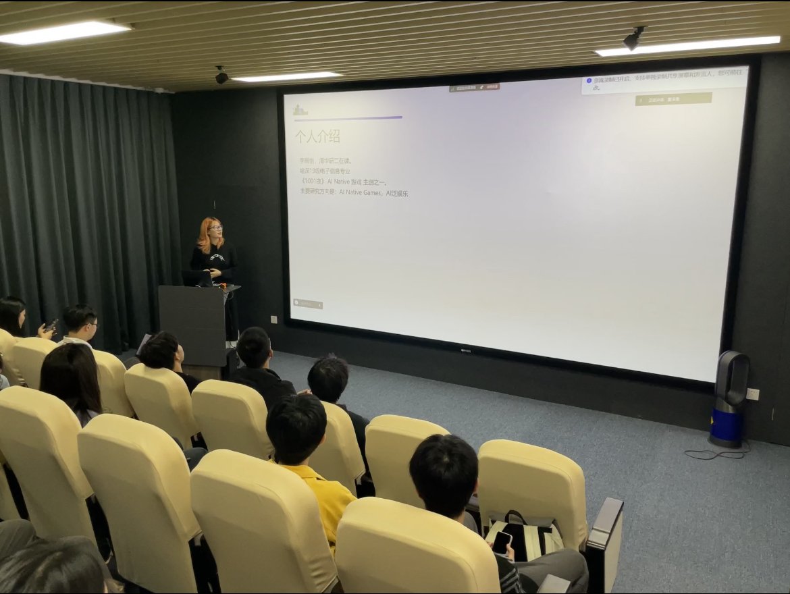

# 与清华学姐共创AI叙事游戏《1001夜》

>
活动海报

&emsp;&emsp;艺数盒子有幸邀请到清华大学《1001夜》核心开发成员李丽怡学姐，带来一场关于 ​​“AI+游戏”​​ 的深度技术分享。现场座无虚席，同学们对AI如何赋能游戏开发展现出极大的热情。

>
参与同学

&emsp;&emsp;分享会上，学姐详细解构了《1001夜》这款AI原生游戏的创作历程。在该游戏中，玩家需要通过“讲故事”来取悦一位由AI驱动的“国王”，而故事的质量将直接决定生成武器的属性。学姐坦言，团队面临的最大挑战在于平衡​​AI技术的无限可能性​​与​​游戏设计的可控性​​，例如如何确保AI生成内容的稳定性，以及避免其产生“幻觉”干扰核心体验。

>
活动现场

&emsp;&emsp;分享不仅局限于自身项目，还拓展到​​“多智能体互动”​​ 等前沿领域，为同学们揭示了AI游戏广阔的创新空间。学姐强调，技术是为创意服务的工具，优秀的游戏最终回归于​​独特的设计和动人的体验​​。

>
主讲人李丽怡学姐

&emsp;&emsp;本次分享为社团成员提供了与一线开发者面对面交流的宝贵机会，极大地拓宽了同学们对游戏开发，特别是AI技术应用的认知边界。我们相信，每一次这样的思想碰撞，都能为成员的创作之路点燃新的灵感火花。

