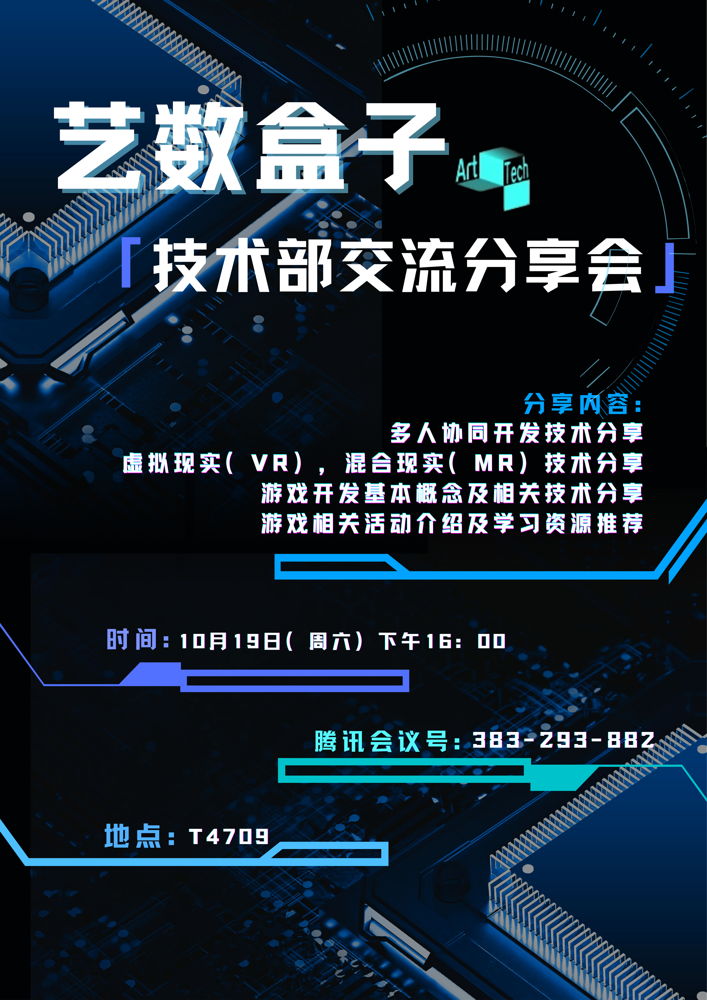
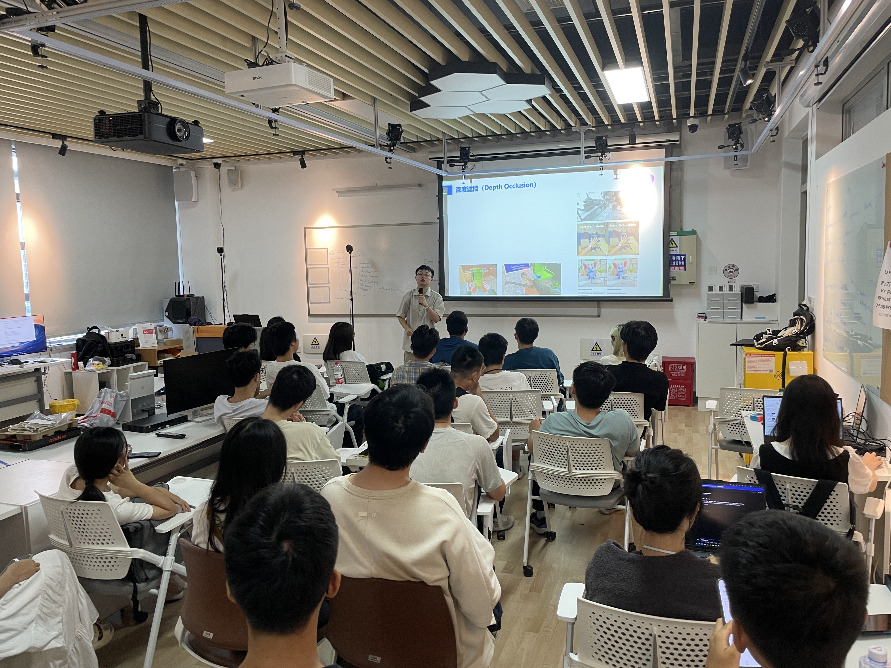
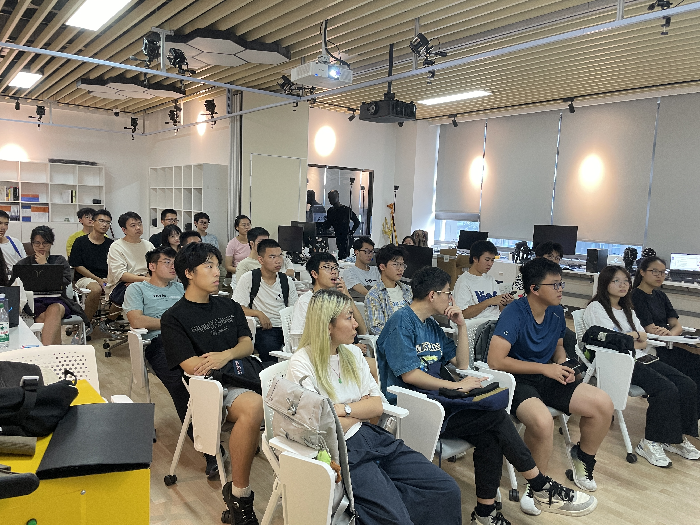

# 技术分享会回顾：一起打开游戏开发的大门！

>
活动海报

&emsp;&emsp;想知道一款游戏是如何从脑海中的奇思妙想，变成我们手机或电脑上栩栩如生的世界的吗？在24年招新结束后，我们为所有新伙伴准备了一场干货满满的技术分享会，正是为了解答这个酷炫的问题！

>
活动现场

&emsp;&emsp;本次分享会由社团核心成员主讲，从“游戏是第一课堂”的理念出发，带领大家进行了一场有趣的技术穿越。我们回顾了游戏开发从“硬核编码”到现代强大游戏引擎的进化史，并深入拆解了游戏引擎的​​六大核心模块​​：负责“大脑”的逻辑脚本、创造视觉奇迹的渲染引擎、模拟真实世界的物理引擎、管理声音的音频引擎、驱动角色表演的动画引擎以及实现多人联机的网络引擎。

>
参与同学

&emsp;&emsp;现场座无虚席，新老成员齐聚一堂。分享内容不仅涵盖了​​多人协同开发、VR/MR等前沿技术​​，更贴心地为大家梳理了游戏开发的学习路径和实用资源。从现场同学们专注的神情中，我们看到了灵感火花的碰撞与对技术的浓厚兴趣。

&emsp;&emsp;这次分享会不仅是一次知识的普及，更是一次社团大家庭的集结。它点燃了许多同学的创作热情。在ArtTech，我们相信技术与艺术同样重要，创意与实践缺一不可。期待在下次活动中，也能看到你的身影！

