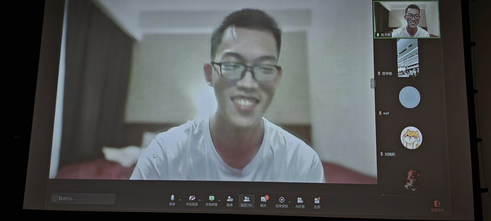
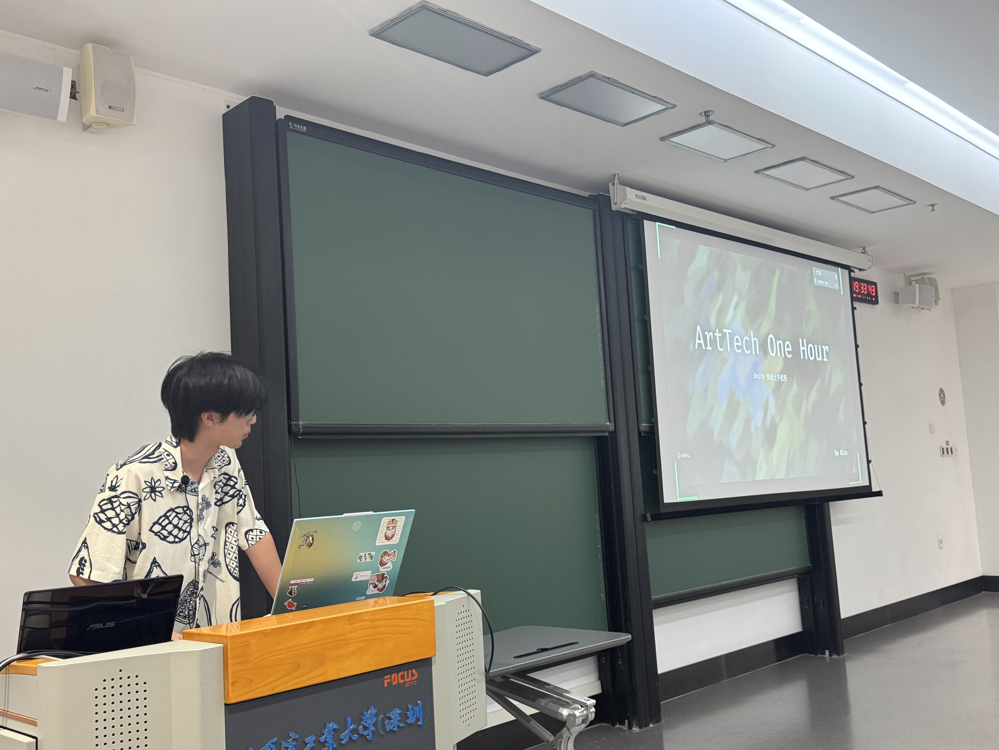
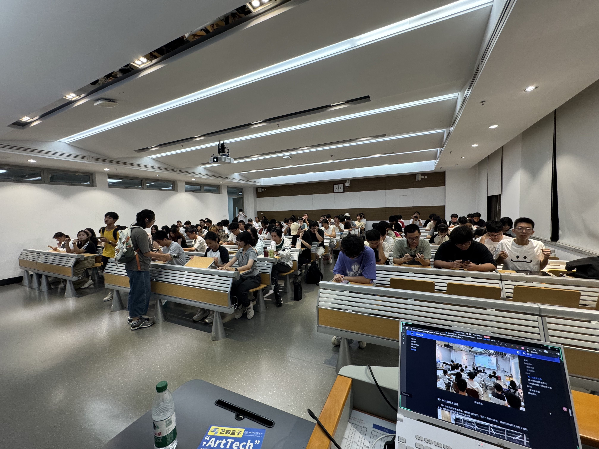

### 社团招新宣讲会：开启你的游戏开发之旅

在今年的招新季，我们举办了一场别开生面的社团招新宣讲会，向新成员全面展示了社团的组织结构、运行机制以及未来活动规划。本次活动不仅帮助新成员深入了解社团文化，还通过精彩的**1小时极限游戏开发演示**，让大家直观感受到游戏开发的魅力与挑战。

>
与社长远程连线

宣讲会从社团的**组织架构**介绍开始，详细说明了各部门的职能与协作方式，让新成员对社团的运作有了清晰认识。随后，核心成员现场进行了一场**极限游戏开发演示**，在1小时内从零开始搭建简易游戏原型。这一环节生动展现了游戏开发从构思到实现的全过程，打破了“开发游戏很难”的刻板印象，极大地激发了新成员的兴趣。

>
核心成员进行游戏开发演示

活动的最后环节是**30天开发活动的现场组队**。新老成员在轻松的氛围中自由交流，根据兴趣和技能组队，并现场填写报名表格。这一设计有效促进了成员间的互动，为后续开发活动奠定了团队基础。

>
认真聆听的同学们

本次宣讲会不仅是一次招新活动，更是一次创意的点燃。我们期待新成员在接下来的30天开发活动中，将今天的兴趣转化为实际的作品，与社团共同成长！