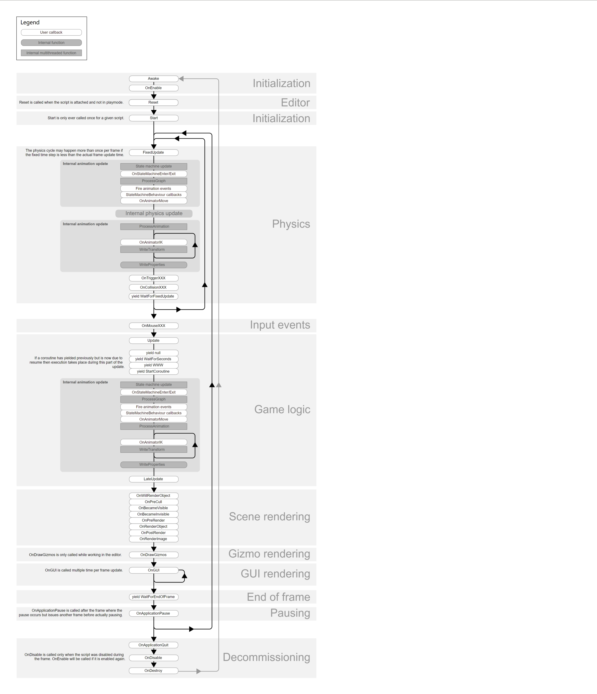

# Unity 能力进阶 - 生命周期 篇

> 本页面由[李杰](../../社团介绍/成员.md)编写并发布

## 概述

你是否还在为 Unity 中各种生命周期函数的调用时机而困惑？

`Awake`、`Start`、`Update`、`FixedUpdate`、`LateUpdate`、`OnEnable`、`OnDisable` 等等，这些函数到底在什么时候被调用？它们之间有什么区别？

弄清楚这些后，你就能更好地控制游戏对象的行为，写出更高效、更稳定的代码。

描述各个生命周期函数的调用时机👇。

## 资源

> *最后更新：2025年9月*
